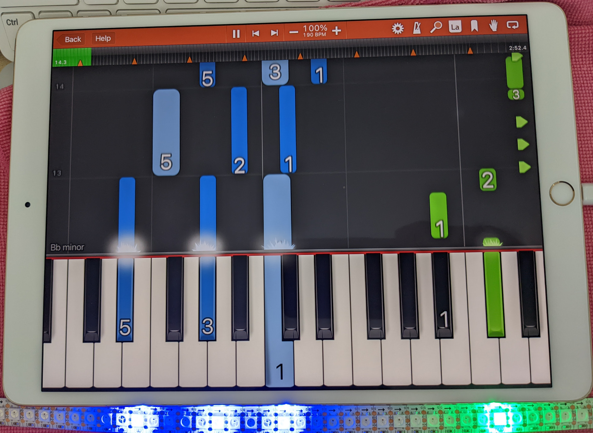
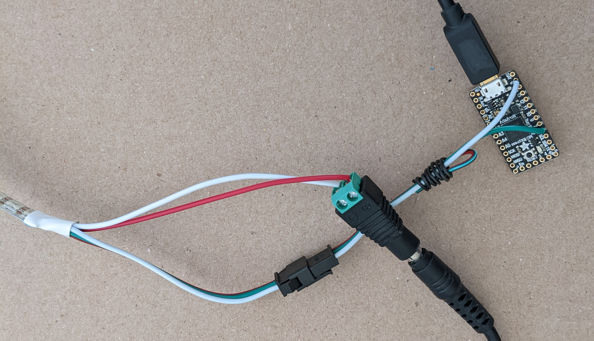
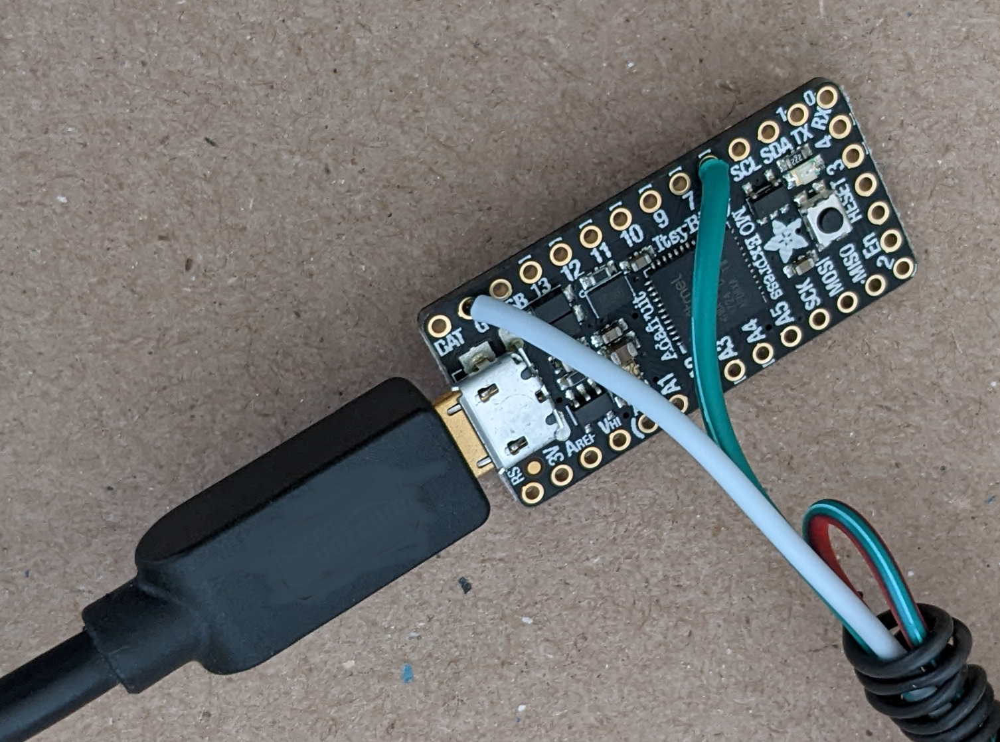
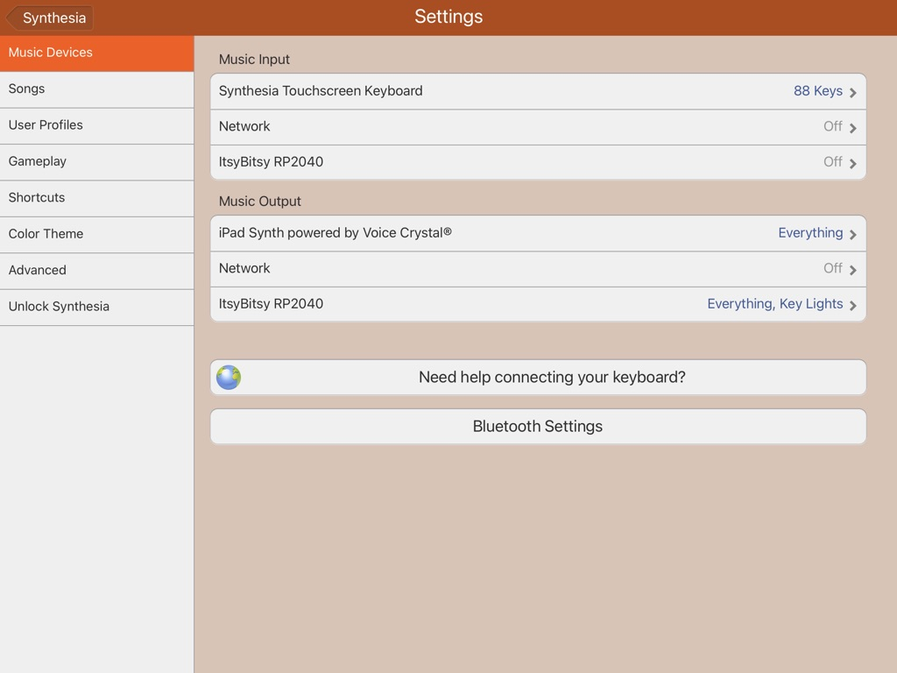
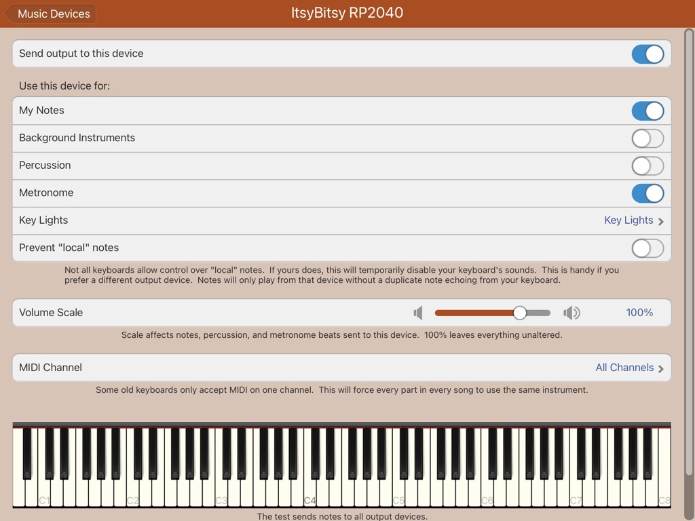
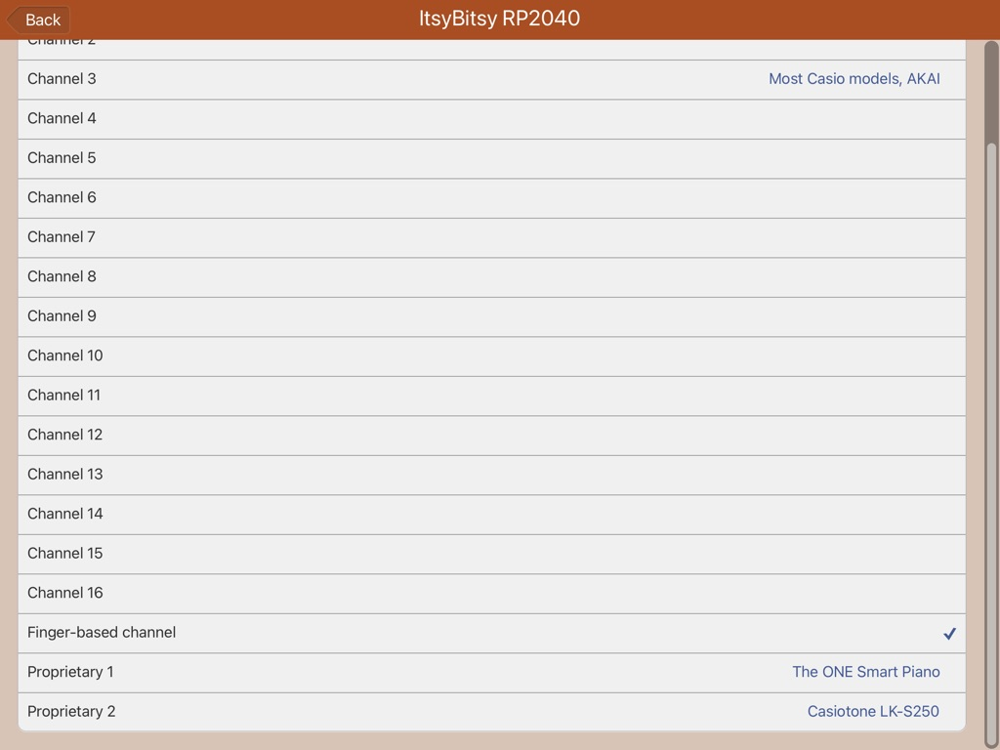

# Piano Key Lights for Synthesia using Adafruit ItsyBitsy RP2040 and CircuitPython

[Synthesia](https://synthesiagame.com) plays piano MIDI files and shows which
key to press on a piano keyboard. This project adds LEDs that turn on and off
based on MIDI messages from Synthesia. The LEDs may be mounted on a real piano
keyboard. Or just used as a MIDI visualizer gadget.



The code in key_led.py must be customized for the number of piano keys
and the width of the keyboard. The default is 1 LED per key which will
only work for a piano with all keys as wide as 1 LED.

Note 1 meter is too small for a full sized 88 key piano keyboard. 2 meter
strips with 144 LEDs per meter are hard to find. It should be possible to
solder two 1 meter strips together then cut off the excess but I have not
tried this.

## Hardware

System Diagram for iPad running Synthesia with LEDs and MIDI keyboar.
```
                                    5V                    5V
                                    |                     |
Synthesia -> iPad -> Adapter -> USB Hub -> ItsyBitsy -> WS2812 LED strip
                                        -> USB MIDI keyboard
```

* Synthesia running on iPad
* iPad camera adapter
* Powered USB hub
* USB MIDI keyboard
* Adafruit ItsyBitsy RP2040
* WS2812 (also known as NeoPixel) LED strip, 144 LED/meter
* 5V 4A power supply for the LED strip





Note: The photos show the M0 variation of the board but the RP2040 has the same
layout. This project was initially developed for the ItsyBitsy M0 board but the
RP2040 board is cheaper, faster, and has more RAM and Flash.

If the USB MIDI keyboard is not needed, the USB hub can be removed. Plug
the ItsyBitsy into the camera adapter.

For Windows or MacOS, replace the iPad, adapter, and USB hub with the
computer running Synthesia.

Note the USB hub has its own 5V power adapter. The iPad does not provide
much power for USB devices so use a POWERED USB hub. The hub is not required
for computers running Windows or MacOS assuming the computers have enough
USB ports.

Note the LED strip has its own 5V power adapter.

Lots of useful information on using WS2812 LED strips here. Adafruit uses the
brand name NeoPixel but they are the same as generic WS2812 LEDs.

https://learn.adafruit.com/adafruit-neopixel-uberguide

The ItsyBitsy RP2040 pin 5 is an output with 5V logic level so it is used
to connect to the WS2812 LED Data pin.

https://learn.adafruit.com/adafruit-itsybitsy-rp2040/pinouts

## CircuitPython

If you are new to CircuitPython the following page is very helpful.

https://learn.adafruit.com/welcome-to-circuitpython

* CircuitPython 7.0.0
* CircuptPython Libraries 7.x-20211222

Directory listing of the CIRCUITPYHON drive. main.py is named key_led.py
in this repo.
```
├── [Dec 23  9:25]  lib
│   ├── [Dec 24  9:29]  adafruit_midi
│   │   ├── [Dec 22  5:08]  control_change.mpy
│   │   ├── [Dec 22  5:08]  control_change_values.mpy
│   │   ├── [Dec 22  5:08]  __init__.mpy
│   │   ├── [Dec 22  5:08]  midi_message.mpy
│   │   ├── [Dec 22  5:08]  note_off.mpy
│   │   └── [Dec 22  5:08]  note_on.mpy
│   └── [Dec 22  5:08]  neopixel.mpy
└── [Dec 23  0:04]  main.py
```

## Software

key_led.py implements the Synthesia Key Lights, finger-based channel protocol.
Synthesia sends USB MIDI note on and off on different MIDI channels that
correspond to left and right fingers. The left finger notes are blue and the
right finger notes are green.

Synthesia finger-based channel keyboard lights protocol is explained here.

https://www.synthesiagame.com/forum/viewtopic.php?p=43585#p43585

## Configuring key_led.py

There is no user interface to configure key_led.py but it is easy to change
the source code using a Mac, Windows, or Linux computer. Plug in the ItsyBitsy
to a USB port. When the CIRCUITPYTHON Flash drive appears, edit the file named
main.py which is the same as key_led.py.

### Increase LED Brightness

The default is 30% brightness set by this line of code.

```
KeyStrip = neopixel.NeoPixel(LED_PIN, LED_COUNT, brightness=0.3, auto_write=False)
```

Change the brightness parameter as high as 1.0.

### Change Number of LEDs

Change this for the number of LEDs in your LED strip.
```
LED_COUNT = 144
```

### Leftmost piano key

Set this to the MIDI note number of the leftmost piano key.

```
LEFTMOST_KEY_NOTE = 21
```

### Select the LED closest to the piano key

This function takes as input the MIDI note number then returns the LED position
to turn off/on. The code currently assumes 1 LED per key which is easy for
testing but is too small. I do not have a 88 key keyboard but as far as I can
tell it is closer to 2 LEDs per piano key. Try 'return 2*ledindex'.

```
def mapPitch2LEDIndex(note):
...
    return ledindex

```

## Configuring Synthesia for Key Lights

Synthesia Settings



On the following screen, note the Percussion and Background Instruments
options are turned off. If they are left on, playing MIDI files with these
tracks will result in LEDs turning on and off that do not correspond to piano
keys. For example, the FNaF songs have percussion tracks.



On the following screen, scroll all the way down for the finger-based channel
option.


